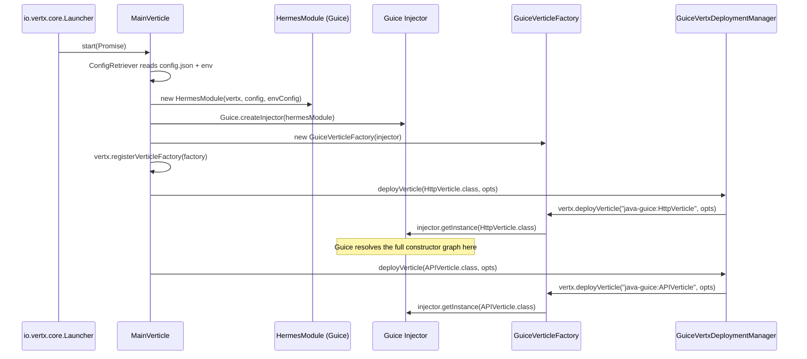
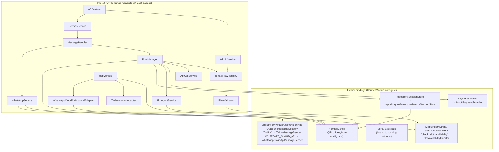
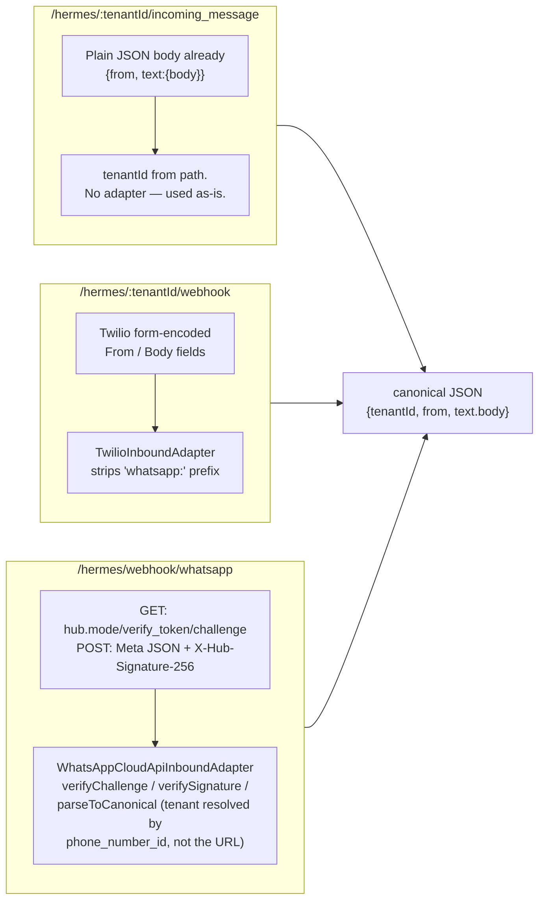
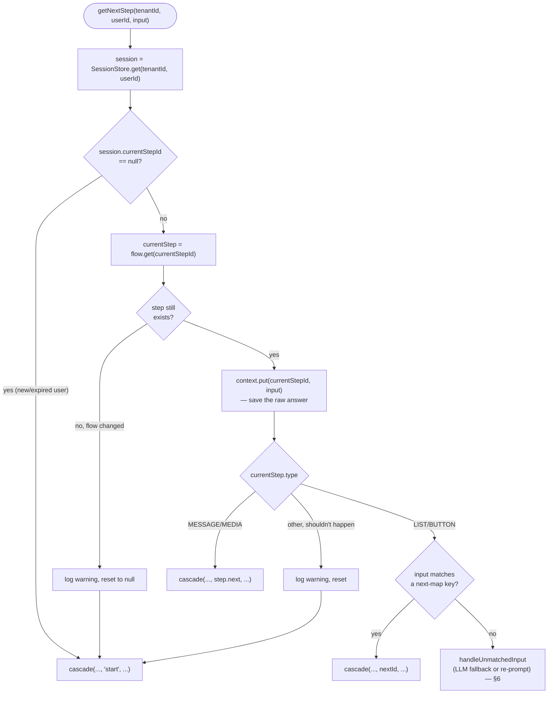
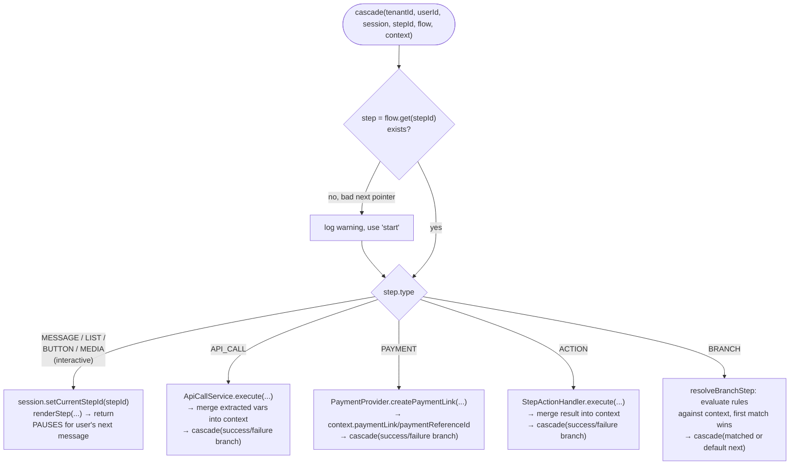
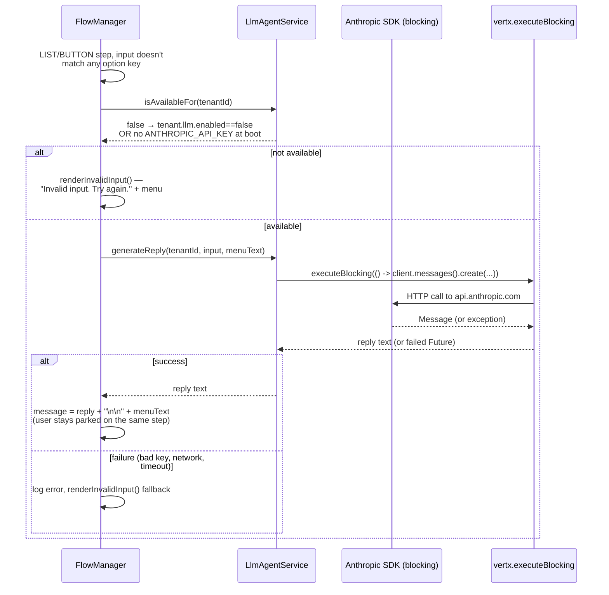
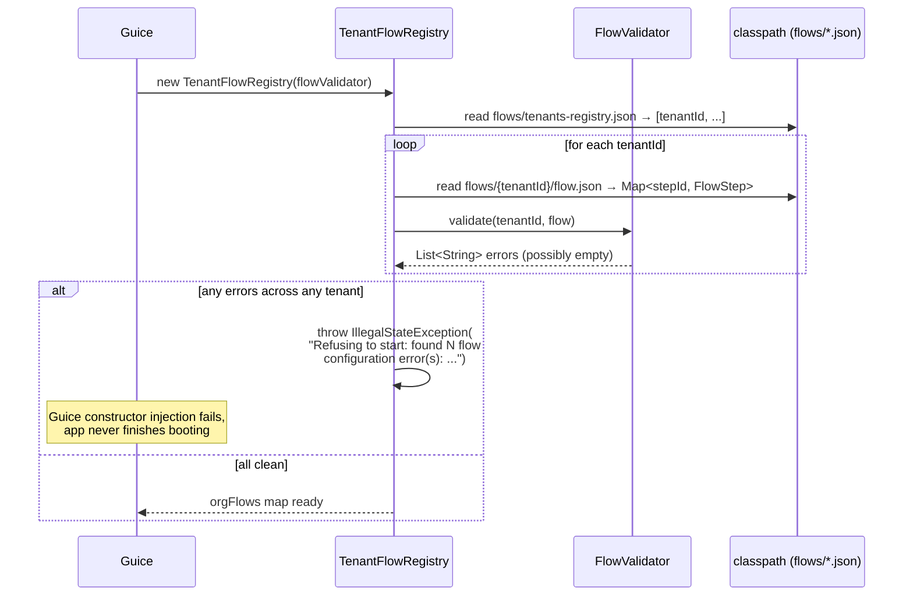
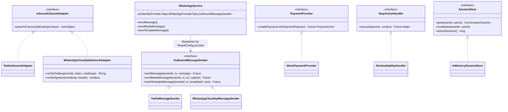
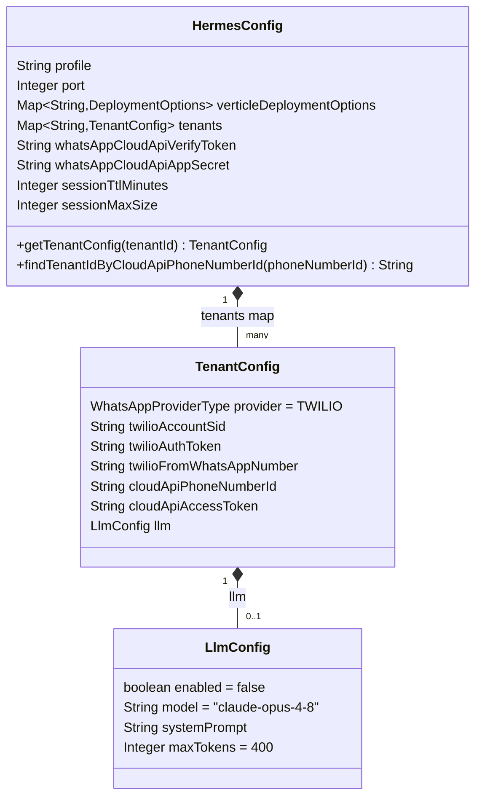
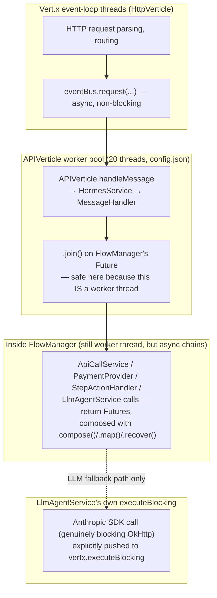

# Hermes — Low-Level Design

This is a code-level companion to [OVERVIEW.md](OVERVIEW.md). OVERVIEW explains *what*
Hermes does; this explains *how the code is actually wired* — every class, every
interface, every dispatch point — so you can predict what a change touches without
opening the whole repo. Each section pairs a diagram with a "what to know" list and the
exact file(s) involved.

---

## 1. Process boot — who creates whom

Hermes is **not** started via Vert.x's own DI. Guice builds every object; Vert.x is told
to fetch verticle instances from the Guice `Injector` instead of calling `new`.



**What to know**
- `MainVerticle.start()` reads `config.json` (worker/instance counts, port, tenant configs)
  via Vert.x `ConfigRetriever`, and env vars separately.
- `HermesModule.configure()` is where every Guice binding lives — read it once, and you
  know every interface→implementation mapping in the app (see §2).
- Verticle class names are prefixed `java-guice:` (`GuiceVerticleFactory.PREFIX`) so Vert.x
  routes verticle creation through `GuiceVerticleFactory.createVerticle`, which just calls
  `injector.getInstance(clazz)` — i.e. **every verticle is itself a Guice-managed object**,
  same as any service class.
- Two verticles are deployed: `HttpVerticle` (non-worker — owns the HTTP server) and
  `APIVerticle` (worker, pool size 20 from `config.json` — where blocking business logic
  runs safely).

**Files**: `verticle/MainVerticle.java`, `module/HermesModule.java`,
`guice/GuiceVerticleFactory.java`, `guice/GuiceVertxDeploymentManager.java`.

---

## 2. Dependency graph — every Guice binding in one picture



**What to know**
- `PaymentProvider`, `SessionStore`, the two `MapBinder`s, `Vertx`/`EventBus`, and
  `HermesConfig` are the **only** things bound explicitly. Everything else (`FlowManager`,
  `ApiCallService`, `LlmAgentService`, `WhatsAppService`, both verticles, …) has no
  `bind(...)` call — Guice just constructs it on demand because it's a concrete class with
  an `@Inject` constructor ("just-in-time" binding). If you're hunting for where a class
  is wired, check `HermesModule` first; if it's not there, it's JIT and the constructor
  signature *is* the wiring.
- `PaymentProvider` and `SessionStore` share the same shape: a one-line
  `bind(Interface.class).to(Impl.class)` for something with exactly one implementation
  today but a real reason to swap later (a real payment gateway; a Redis-backed store).
  The `MapBinder`s are for *multiple* simultaneous implementations selected at runtime;
  a plain `bind().to()` is for *one* implementation selected at compile time.
- The two `MapBinder`s are the extension points: adding a third WhatsApp provider or a new
  `ACTION` handler is one `addBinding(...)` line here, nothing else in the DI graph
  changes.
- `FlowValidator` and `WhatsAppCloudApiInboundAdapter` both depend on things bound here
  (`Map<String,StepActionHandler>`, `HermesConfig`) — that's why they can validate/route
  without any flow-specific code knowing about providers or handlers.

**File**: `module/HermesModule.java`.

---

## 3. Request lifecycle — a message from the wire to a reply

This is the single most important diagram: **every** inbound message, regardless of
provider or tenant, funnels through this exact path.

```mermaid
sequenceDiagram
    participant Provider as Twilio / Meta / test client
    participant HV as HttpVerticle
    participant Adapter as Inbound*Adapter
    participant Bus as Vert.x EventBus
    participant AV as APIVerticle
    participant HS as HermesService
    participant MH as MessageHandler
    participant FM as FlowManager
    participant WAS as WhatsAppService
    participant Sender as Outbound*Sender

    Provider->>HV: POST /hermes/:tenantId/webhook (Twilio)<br/>or /hermes/webhook/whatsapp (Meta)<br/>or /hermes/:tenantId/incoming_message (test JSON)
    HV->>Adapter: parseToCanonical(routingContext)
    Adapter-->>HV: {tenantId, from, text:{body}}
    HV->>Bus: eventBus.request("incomingMessage", canonicalJson)
    Bus->>AV: consumer for INCOMING_MESSAGE_EVENT
    AV->>HS: handleIncomingMessage(JsonObject)
    HS->>MH: handleIncomingMessage(IncomingMessageRequest)
    MH->>FM: getNextStep(tenantId, userId, input)
    Note over FM: async — resolves session, runs/<br/>cascades steps (§5), returns FlowStepResult
    FM-->>MH: Future&lt;FlowStepResult&gt;
    MH->>MH: .toCompletionStage().toCompletableFuture().join()
    MH->>WAS: sendMessage / sendMediaMessage /<br/>sendTemplateMessage(tenantId, userId, ...)
    Note over MH,WAS: fire-and-forget — failure is logged,<br/>never blocks the HTTP ack
    WAS->>Sender: pick sender by TenantConfig.provider
    Sender-->>Provider: actual WhatsApp API call
    MH-->>HS: JsonObject {message, mediaType?, mediaUrl?, contentSid?}
    HS-->>AV: same JsonObject
    AV-->>Bus: message.reply(Response.getSuccessResponse(json))
    Bus-->>HV: async result
    HV-->>Provider: HTTP 200 + Response JSON
```

**What to know**
- **HttpVerticle never talks to FlowManager directly.** It only parses the raw request
  into the canonical JSON shape and hands it to the event bus — this is what makes the
  transport layer swappable without touching business logic.
- The event bus hop means `HttpVerticle` and `APIVerticle` could run on different
  threads/verticle instances entirely; today they're both in the same process, but the
  address-based dispatch (`INCOMING_MESSAGE_EVENT = "incomingMessage"`) is what would let
  you scale them independently later.
- `MessageHandler` is the one place that **blocks** — it joins the async
  `Future<FlowStepResult>` synchronously (`.join()`) because `APIVerticle` is a **worker**
  verticle (`workerPoolSize: 20`), so blocking a worker thread is safe by design here.
- The outbound send (`WhatsAppService...`) happens *after* the flow result is computed but
  its success/failure is **never awaited** by the HTTP response — a broken Twilio/Meta call
  logs a warning and the webhook still acks 200. This is deliberate: providers retry
  webhooks that don't get a fast 200.

**Files**: `verticle/HttpVerticle.java`, `verticle/APIVerticle.java`,
`service/HermesService.java`, `service/MessageHandler.java`, `service/FlowManager.java`,
`service/WhatsAppService.java`.

---

## 4. The three inbound routes, side by side



**What to know**
- Route 1 is for local testing / a BSP that already emits the canonical shape.
- Route 2 exists because **Twilio lets you configure a distinct webhook URL per WhatsApp
  number** — so each tenant can have its own URL with `tenantId` already in the path.
- Route 3 exists because **Meta does not** — one Meta app has exactly one webhook URL
  covering every phone number under it, so the tenant has to be resolved *from the payload*
  (`HermesConfig.findTenantIdByCloudApiPhoneNumberId`), and Meta requires two things Twilio
  doesn't: a `GET` verification handshake at registration time, and an HMAC signature
  (`X-Hub-Signature-256`) on every `POST`, checked in `WhatsAppCloudApiInboundAdapter`
  using `HermesConfig.whatsAppCloudApiAppSecret`.
- An unroutable Meta payload (unknown `phone_number_id`) still gets HTTP 200 — Meta
  auto-disables webhooks that ever return non-200, so `HttpVerticle` deliberately acks and
  drops rather than erroring.

**Files**: `constant/URIConstant.java` (route constants), `verticle/HttpVerticle.java`
(route registration + the three handler methods), `service/channel/TwilioInboundAdapter.java`,
`service/channel/WhatsAppCloudApiInboundAdapter.java`.

---

## 5. `FlowManager` — the state machine at the heart of everything

This is the class to understand deeply; everything else is plumbing around it.

### 5.1 Two categories of step, one dispatch method





**What to know**
- **Only four step types pause and wait**: `MESSAGE`, `LIST`, `BUTTON`, `MEDIA`. Everything
  else (`API_CALL`, `PAYMENT`, `ACTION`, `BRANCH`) is "automatic" — it runs immediately with
  no user input and recursively calls `cascade(...)` again, so a single incoming message
  can walk through several automatic steps in one HTTP request before finally pausing at
  an interactive step (e.g. `collect_slot` → `check_availability` (ACTION) → `route_fee`
  (BRANCH) → `take_payment_new` (PAYMENT) → `booking_confirmed` (MESSAGE, pauses) — four
  cascades from one user message).
- **Context is a flat `Map<String,Object>`, keyed by step id for raw answers**, plus
  whatever `API_CALL`/`PAYMENT`/`ACTION` explicitly write in (e.g. `paymentLink`,
  `orderId`, `availabilityNote`). There's no schema — any step's `{{key}}` template just
  looks up that key.
- **`resolveBranchNext(step, success)`** (used by `API_CALL`/`PAYMENT`/`ACTION`) is
  different from **`resolveBranchStep(step, context)`** (used by `BRANCH`): the former
  picks `success`/`failure` keys out of a `next` map based on a boolean outcome; the latter
  evaluates a list of `{when, equals, next}` rules against accumulated context. Don't
  confuse them — same-sounding names, different jobs.
- **Self-healing, not crash-prone**: an undefined `next` target, a step id that no longer
  exists in an edited flow, or a corrupted/expired session all resolve to `start` with a
  logged warning rather than propagating an exception up to the user.

**File**: `service/FlowManager.java`.

---

## 6. LLM fallback — exactly when it fires



**What to know**
- The fallback **only** triggers on `LIST`/`BUTTON` steps with unmatched input.
  `MESSAGE` steps accept literally anything as the answer (that's the point — free text),
  so there's no "unmatched" case to fall back from there.
- `isAvailableFor` is checked *before* touching the network — it's `client != null &&
  tenant.llm.enabled`, both cheap in-memory checks. The Anthropic client itself is
  constructed once at `LlmAgentService` startup (`AnthropicOkHttpClient.fromEnv()`); if
  `ANTHROPIC_API_KEY` isn't set, `client` is left `null` permanently, not retried per
  request.
- The system prompt sent to the model is built per-call in
  `LlmAgentService.buildSystemPrompt`: the tenant's configured persona +
  fixed WhatsApp-reply-style instructions + the **current menu text**, so the model can
  both answer the user and steer them back to a valid option in the same reply.
- Nothing about this path is aware of `BRANCH`/`ACTION`/`API_CALL` — it's a pure
  interception inside the `LIST/BUTTON` unmatched-input branch of `getNextStep`.

**Files**: `service/LlmAgentService.java`, `service/FlowManager.java`
(`handleUnmatchedInput`), `config/LlmConfig.java`.

---

## 7. Session store — the cache underneath every user

Lives in `repository/` (not `service/`): `SessionStore` is a storage contract
(`get`/`invalidate`/`activeSessions`), and `InMemorySessionStore` is its only current
implementation, bound in `HermesModule` exactly like `PaymentProvider`. `FlowManager`
depends on the interface only.

```mermaid
flowchart LR
    subgraph key["Cache key"]
        K["tenantId + '|' + userId"]
    end
    K --> Cache["Guava Cache&lt;String, ConversationSession&gt;"]
    Cache -->|expireAfterAccess| TTL["sliding 5-min idle TTL<br/>(default; HermesConfig.sessionTtlMinutes)"]
    Cache -->|maximumSize| LRU["10,000-entry LRU cap<br/>(default; HermesConfig.sessionMaxSize)"]
    Cache --> Session["ConversationSession<br/>= currentStepId (nullable) + context Map"]
    Get["SessionStore.get(tenantId, userId)"] -->|cache.get(key, ConversationSession::new)| Cache
    Note1["atomic load — two near-simultaneous<br/>messages from a brand-new user can't<br/>create two different sessions"]
```

**What to know**
- `SessionStore.get(...)` uses Guava's `Cache.get(key, Callable)` (not
  `getIfPresent`+`put`), which is the load-atomically form — this is what prevents a race
  where a user's very first two messages arrive close together and each spawns its own
  session, silently losing one of them.
- **TTL is sliding, not absolute** — `expireAfterAccess` resets the countdown on *every*
  cache read, which `getNextStep` does on every message. A user mid-conversation never
  times out just because the conversation is long; only genuine inactivity expires them.
- Eviction (TTL or LRU) is invisible to the user — `ConversationSession.currentStepId`
  simply won't be found next time (`SessionStore.get` creates a fresh one), which
  `FlowManager` already treats as "new session → render `start`". There's no special-case
  eviction handling anywhere else.
- `ConversationSession` itself is a dumb bag: `currentStepId` (`volatile String`, settable)
  and `context` (a `ConcurrentHashMap` created once, never replaced). One
  `ConversationSession` instance is shared and mutated across the whole conversation.

**Files**: `repository/SessionStore.java` (interface), `repository/inMemory/InMemorySessionStore.java` (impl), `pojo/ConversationSession.java`,
`config/HermesConfig.java` (`sessionTtlMinutes`/`sessionMaxSize`).

---

## 8. Startup validation — how a bad `flow.json` is caught before traffic



**What `FlowValidator` checks, per step type** (all errors collected, not fail-fast):

| Step type | Checks |
|---|---|
| every step | `type` recognized; every `next` target (string or map value) points at a real step id in the same flow |
| `LIST`/`BUTTON` | non-empty `options`; `next` is a map; every `options` key has a matching `next` entry |
| `API_CALL` | non-blank `apiUrl` |
| `PAYMENT` | non-blank `paymentAmount` |
| `MEDIA` | non-blank `mediaType` and `mediaUrl` |
| `ACTION` | non-blank `action` name **and** that name exists in the injected `Map<String,StepActionHandler>` (the live Guice registry) |
| `BRANCH` | non-empty `branches`, each with `when`+`equals`; every branch's `next` and the step's default `next` point at real steps |
| any flow | a `start` step exists |

**What to know**
- `FlowValidator`'s constructor takes `Map<String, StepActionHandler> actionHandlers` —
  the *exact same* Guice-bound map `FlowManager` uses at runtime. This is why an `ACTION`
  step naming a handler that was never registered in `HermesModule` fails **at boot**,
  with the registered names listed in the error, instead of throwing a null pointer the
  first time some user reaches that step.
- This runs once, synchronously, inside `TenantFlowRegistry`'s constructor — which Guice
  invokes while building the object graph for `MainVerticle`'s first `getInstance` call.
  A validation failure means the process never finishes starting, which is the intended
  "fail loud, fail early" behavior.

**Files**: `service/flow/TenantFlowRegistry.java`, `service/flow/FlowValidator.java`.

---

## 9. Class relationships — interfaces and their implementations

Hermes uses interfaces at exactly four extension points. Recognizing this shape tells
you where to add code for a new provider, payment gateway, session backend, or
in-process action.



**What to know**
- **`HttpVerticle` picks the inbound adapter by *route*** (Twilio's own route always uses
  `TwilioInboundAdapter`; Meta's shared route always uses
  `WhatsAppCloudApiInboundAdapter`) — there's no runtime "adapter registry" for inbound,
  because the route itself already tells you the provider.
- **`WhatsAppService` picks the outbound sender by *tenant config*, at runtime**, via the
  `Map<WhatsAppProviderType, OutboundMessageSender>` Guice gives it. This is the one place
  with genuine runtime polymorphism — same code path, different sender object depending on
  `TenantConfig.provider`.
- **Adding a fourth provider** = one new `WhatsAppProviderType` enum value + one class per
  interface + two `MapBinder.addBinding(...)` lines (or one, if you only need outbound) in
  `HermesModule`. Nothing in `FlowManager`, `MessageHandler`, or the flow JSON schema
  changes.
- **Adding a new `ACTION` handler** = implement `StepActionHandler`, add one
  `actionBinder.addBinding("name").to(YourHandler.class)` line. `FlowValidator` and
  `FlowManager` both read the same map, so it's immediately both validated and executable.
- **`SessionStore` is the odd one out on purpose**: it's the only one of the four that
  lives under `repository/` instead of `service/`. The other three are dispatch points for
  *business logic with several valid implementations chosen by config*; `SessionStore` is
  a *storage* concern with one implementation today — the same shape as `PaymentProvider`
  (plain `bind().to()`, not a `MapBinder`). A `repository/redis/RedisSessionStore` is the
  natural next implementation for multi-instance durability.

**Files**: `service/channel/*.java`, `service/payment/*.java`, `service/action/*.java`,
`repository/SessionStore.java` + `repository/inMemory/InMemorySessionStore.java`,
`service/WhatsAppService.java`, `enums/WhatsAppProviderType.java`.

---

## 10. Config object graph — what's in `config.json` and where it lands



**What to know**
- `HermesConfig` is populated once, at boot, via `config.mapTo(HermesConfig.class)`
  (Vert.x `JsonObject` → POJO, Jackson-backed) in `HermesModule`'s constructor — it's a
  Guice singleton (`@Provides @Singleton HermesConfig provideConfig()`), so every injected
  `HermesConfig` anywhere in the app is the exact same instance, read-only after boot.
- `whatsAppCloudApiVerifyToken`/`AppSecret` and `sessionTtlMinutes`/`sessionMaxSize` are
  **top-level**, not per-tenant — the former because one Meta app's webhook covers many tenants,
  the latter because the session cache is one process-wide `SessionStore`.
- The **Anthropic API key is never in this object graph at all** — `LlmAgentService`
  reads `System.getenv("ANTHROPIC_API_KEY")` directly, deliberately kept out of
  `HermesConfig`/`config.json` so it can never end up committed or logged via a config dump.
- `TenantConfig.provider` defaults to `TWILIO` (a field initializer, not a null-check) —
  this is why every tenant that existed before the channels work needed zero config changes.

**Files**: `config/HermesConfig.java`, `config/TenantConfig.java`, `config/LlmConfig.java`,
`config.json`.

---

## 11. Package map — where to look for what

```
com.flauntik
├── verticle/          HttpVerticle (HTTP router), APIVerticle (event-bus consumer), MainVerticle (boot)
├── guice/              GuiceVerticleFactory, GuiceVertxDeploymentManager — Guice↔Vert.x glue;
│                        GuiceVertxLauncher — alternate entry point used only by the IDE run
│                        config (.run/Hermes-Run.run.xml); the packaged fat jar boots via
│                        plain io.vertx.core.Launcher + the Main-Verticle manifest entry instead
├── module/              HermesModule — every DI binding lives here
├── config/              HermesConfig, TenantConfig, LlmConfig — config.json → POJOs
├── constant/            URIConstant (routes + event-bus addresses), LoggerConstant
├── enums/               FlowStepType, WhatsAppProviderType
├── pojo/                FlowStep, Branch, FlowStepResult, ConversationSession, payment/*
├── dto/                 request/ (IncomingMessageRequest, LoggingRequest), response/Response
├── jackson/deserializer/ NextFieldDeserializer — flow.json's polymorphic `next` field
├── repository/           storage-layer contracts, not business logic (§7, §9)
│   ├── SessionStore                interface
│   └── inMemory/
│       └── InMemorySessionStore     default binding (Guava cache, TTL + LRU)
├── service/
│   ├── FlowManager           the state machine (§5)
│   ├── MessageHandler         event-bus handler → FlowManager → WhatsAppService
│   ├── HermesService           thin JsonObject↔DTO shim in front of MessageHandler
│   ├── AdminService             /admin/set_logging, /admin/tenants
│   ├── ApiCallService            executes API_CALL steps
│   ├── LlmAgentService            the LLM fallback (§6)
│   ├── WhatsAppService             outbound dispatcher (§9)
│   ├── flow/                       TenantFlowRegistry, FlowValidator (§8)
│   ├── channel/                    inbound adapters + outbound senders (§9)
│   ├── payment/                    PaymentProvider + MockPaymentProvider
│   └── action/                     StepActionHandler + SlotAvailabilityHandler
└── util/                 TemplateUtil ({{var}} substitution), CommonUtil (shared Jackson mapper)
```

**File-to-concept quick lookup**

| I want to change... | Start at |
|---|---|
| A tenant's conversation | `src/main/resources/flows/{tenantId}/flow.json` — see [flow-authoring.md](../.agents/rules/flow-authoring.md) |
| How a step type executes | `service/FlowManager.java` (`cascade`) |
| What fields a step type accepts | `pojo/FlowStep.java` + `service/flow/FlowValidator.java` |
| Add a WhatsApp provider | `enums/WhatsAppProviderType.java`, `service/channel/`, `module/HermesModule.java` |
| Add an in-process action | `service/action/`, `module/HermesModule.java` |
| Swap the payment gateway | `service/payment/PaymentProvider.java` impl + `module/HermesModule.java` binding |
| LLM persona / model | `config.json` → `tenants.{tenantId}.llm`, behavior in `service/LlmAgentService.java` |
| Session TTL / size | `config.json` → top-level `sessionTtlMinutes`/`sessionMaxSize`; mechanics in `repository/inMemory/InMemorySessionStore.java` |
| Swap the session backend (e.g. Redis) | `repository/SessionStore.java` interface + a new `repository/{backend}/` impl + `module/HermesModule.java` binding |
| A new HTTP route | `constant/URIConstant.java` + `verticle/HttpVerticle.java` (thin) + `verticle/APIVerticle.java` (dispatch) + a `service/` class (logic) |
| Request/response DTOs | `dto/request/`, `dto/response/Response.java` |

---

## 12. Threading model — what runs where



**What to know**
- `HttpVerticle` itself also wraps its event-bus dispatch in `vertx.executeBlocking` (see
  `dispatchToEventBus`) — even the "thin" router does its param/body assembly off the
  event loop, though that work is cheap.
- The one **explicitly** blocking call in the whole system is the Anthropic SDK request in
  `LlmAgentService.generateReply` — it's wrapped in its own `vertx.executeBlocking`
  precisely because it's a synchronous OkHttp call, not a Vert.x-native async client like
  `WebClient` (which `ApiCallService`, `WhatsAppService`'s senders, and the payment
  provider all use, and which don't need `executeBlocking` since they're non-blocking by
  construction).
- `MessageHandler.handleIncomingMessage`'s `.join()` is the only place the async
  `FlowManager` result is forced synchronous — deliberately, because `APIVerticle` runs on
  the worker pool where blocking a thread doesn't stall the whole server (unlike blocking
  an event-loop thread, which would).

**Files**: `verticle/HttpVerticle.java`, `verticle/APIVerticle.java`,
`service/MessageHandler.java`, `service/LlmAgentService.java`, `config.json`
(`verticleDeploymentOptions.APIVerticle.workerPoolSize`).

---

## Reading order if you're new to this codebase

1. §1–2 (boot + DI graph) — orients you to "nothing is `new`'d directly, check
   `HermesModule` and constructors."
2. §3–4 (request lifecycle + the three routes) — the one path every message takes.
3. §5 (`FlowManager`) — the actual business logic; everything else is in service of this.
4. §6–8 (LLM, sessions, validation) — the three cross-cutting concerns layered onto §5.
5. §9–10 (interfaces, config) — the extension points, for when you need to *add* something.
6. §11–12 (package map, threading) — reference material to come back to.
