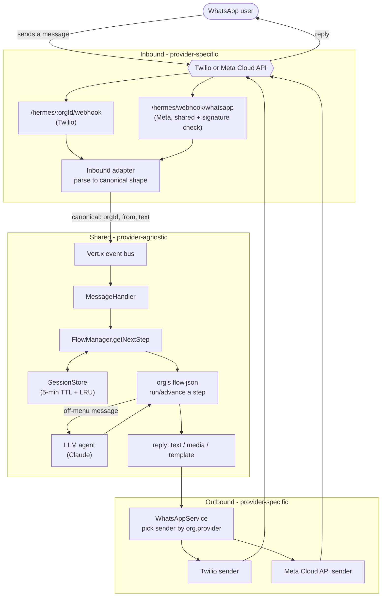

# Hermes — How it all works

A plain-English tour of the whole system: what happens from the moment someone sends a
WhatsApp message to the moment they get a reply. Read this first; the deeper references
are linked at the bottom.

---

## What Hermes is

Hermes is a WhatsApp chatbot backend where **each organization ("org") defines its own
conversation as a JSON file** — menus, questions, external API calls, in-process logic,
payments, media, and conditional routing. Anything a user types that *isn't* part of the
scripted flow is answered by an **LLM agent**. WhatsApp connectivity (both receiving and
sending) is **pluggable per org** — Twilio or Meta's WhatsApp Cloud API today.

The point: onboarding an org and changing its conversation is **configuration, not code**.

---

## The whole flow at a glance

The shape to remember: messages arrive **provider-specific**, get normalized to one
**canonical shape**, flow through a **shared engine**, and only re-diverge by provider when
sending the reply. Add a new provider = one inbound adapter + one outbound sender; the
engine never changes.

---

## The journey of a message

1. **A message arrives.** Twilio and Meta each POST to a different webhook; a shared Meta
   endpoint also verifies a signature and figures out which org the number belongs to. An
   **inbound adapter** turns the provider's payload into one canonical shape:
   `{ orgId, from, text }`. (There's also a plain JSON test route for local development.)

2. **It crosses the event bus** to `MessageHandler`, which asks `FlowManager` for the next
   step: `getNextStep(orgId, userId, text)`.

3. **FlowManager loads that org's flow** and the user's **session** (where they are + what
   they've answered so far). A brand-new or expired user starts at the flow's `start` step.

4. **It runs/advances a step.** Interactive steps (a message, a menu, media) render a reply
   and **pause** for the user's next message. Automatic steps (call an API, take a payment,
   run in-process logic, branch) execute immediately and **cascade** to the next step.
   - If the user was at a menu and typed something that isn't a valid option, the **LLM
     agent** answers their question (if the org enabled it) and re-shows the menu.

5. **The reply goes back out.** `WhatsAppService` looks at the org's configured provider and
   hands the reply to the matching sender (Twilio or Meta), which delivers it on WhatsApp.

Everything the user answers is remembered in their **session** so later steps can use it
(`{{their_answer}}`) — and so a choice made early can change the flow much later.

---

## The building blocks

### Orgs
A tenant. Each org has an id (e.g. `clinic`), a `flow.json`, a provider + credentials, and
optionally its own LLM persona. Adding one is 5 steps — see
[flow-authoring.md](../.agents/rules/flow-authoring.md).

### Flows & steps
A flow is a JSON map of `step id → step`. `start` is the entry point. Step types:

| Type | What it does | Pauses for input? |
|---|---|---|
| `message` | Send text, capture the free-text reply | yes |
| `list` / `button` | A numbered menu; route by the option chosen | yes |
| `media` | Send an image/video/audio/document | yes |
| `api_call` | Call an **external HTTP API**, extract fields, branch on success/failure | no |
| `action` | Run **in-process logic** (a registered handler), branch on its result | no |
| `payment` | Create a payment link via the payment provider | no |
| `branch` | Route to different steps based on an **earlier** answer | no |

`api_call` vs `action`: use `api_call` when the logic lives in another service reachable
over HTTP; use `action` when it lives inside Hermes (a DB check, a business rule). Full
field-by-field reference: [flow-authoring.md](../.agents/rules/flow-authoring.md).

### Sessions
Each user's position + answers live in a `ConversationSession`, cached with a **5-minute
idle TTL** (resets on every message) and an **LRU cap** (bounded memory). Idle past the TTL
→ they harmlessly restart at `start`. Currently in-memory per instance (a Redis-backed
version is the path to multi-instance durability).

### Channels (providers)
Inbound and outbound are pluggable per org via `OrgConfig.provider`
(`TWILIO` | `WHATSAPP_CLOUD_API`). The Meta path implements the real Cloud API webhook
(GET verification handshake + `X-Hub-Signature-256` validation, org resolved by
`phone_number_id`). Details: [hermes-architecture.md](../.agents/rules/hermes-architecture.md).

### LLM fallback
When a user sends something off-script at a menu, an org with `llm.enabled` gets a Claude
reply instead of a canned "invalid input". Per-org model + persona; the API key comes from
the `ANTHROPIC_API_KEY` environment variable (never config). No key → it silently falls
back to the re-prompt, so the bot always works.

### Payments
`payment` steps create a link via a `PaymentProvider`. The shipped one is a **mock** (great
for demos); swapping in a real Razorpay/Stripe provider is one Guice binding change — the
flow JSON doesn't change.

---

## A real example: the clinic booking

`flows/clinic/flow.json` is a complete working flow. Here's a user's messages and what
Hermes does (this is exactly what the test route replays):

| User sends | Hermes does | Reply |
|---|---|---|
| `hi` | new session → render `start` | "Welcome to BrightCare Clinic… 1. Book a consultation  2. Clinic hours" |
| `do you treat migraines?` | not a menu option → **LLM agent** answers, re-shows menu | AI reply + the menu again |
| `1` | route to booking | "Have you visited us before? 1. New  2. Returning" |
| `1` (new) | stored as `patient_type` | "What's your full name?" |
| `Asha` | stored as `collect_name` | "Thanks Asha! What would you like to consult about?" |
| `skin rash` | stored as `collect_reason` | "What day and time works best?" |
| `Sunday 10 AM` | **`action`** `check_slot_availability` → closed Sundays → failure branch | "Sorry, the clinic is closed on Sundays — pick another day" |
| `Monday 10 AM` | availability ok → **`branch`** on `patient_type` = new → ₹700 payment | "…Complete your payment here: <link> …" |

That one flow exercises `message`, `list`, `action`, `branch`, and `payment`, plus the LLM
fallback — all defined in JSON.

---

## Where to go next

| I want to… | Read |
|---|---|
| **Understand the system** (you're here) | this doc |
| **Run it and message it from a real phone** | [GO_LIVE.md](../GO_LIVE.md) |
| **Add a new org / write or edit a flow** | [flow-authoring.md](../.agents/rules/flow-authoring.md) |
| **Understand the code internals** | [hermes-architecture.md](../.agents/rules/hermes-architecture.md) |
| **Build & run commands** | [maven-build.md](../.agents/rules/maven-build.md) |
